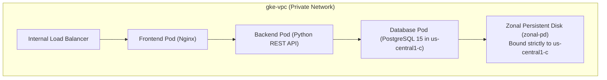
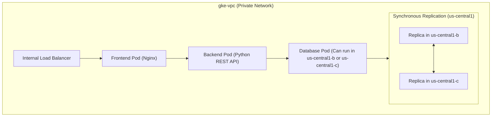

# 3-Tier Private Pets Platform on GKE with Resilient Regional Storage Migration

Welcome to the **Pets Food & Toys Platform** GKE repository. This repository contains the production-ready Kubernetes manifests to deploy a completely secure, fully private 3-tier web application on Google Kubernetes Engine (GKE), alongside a battle-tested operational runbook for migrating stateful workloads from zonal persistent disks to high-availability regional persistent disks with zero data loss.

---

## Architectural Principles

1. **Zero Public Access**: GKE worker nodes have completely private IP addresses.
2. **Secure Ingress**: The frontend web interface is exposed strictly inside the Google Cloud Virtual Private Cloud (VPC) using an Internal Load Balancer (ILB).
3. **Secure Egress**: Outbound connections (e.g., to fetch Python and Alpine dependencies) are securely routed through a regional Cloud NAT gateway.
4. **Zonal State Storage (Initial)**: The stateful database uses dynamically provisioned zonal persistent disks.
5. **Regional High-Availability (Target)**: Stateful storage is upgraded to Google Cloud Regional Persistent Disks (Regional PDs), synchronously replicating data write-by-write across two independent zones.

---

## System Architecture

### 1. Initial State (Zonal Storage)
In our starting setup, the database pod is tied to a single zone. If that zone fails, the database becomes completely unavailable:



### 2. High-Availability Target State (Regional Storage)
After completing the migration, the database is backed by a Regional Persistent Disk that replicates data synchronously across two zones. If one zone fails, GKE hot-migrates the database pod to the healthy zone:



---

## Repository Structure

```
├── kubernetes/
│   ├── 01-storageclass.yaml         # Zonal StorageClass
│   ├── 02-app-code-configmaps.yaml  # Static web & API server codes
│   ├── 03-postgres-db.yaml          # Database Secret, Service & StatefulSet
│   ├── 04-backend.yaml              # Python backend API deployment
│   └── 05-frontend.yaml             # Frontend Nginx deployment & ILB
├── kubernetes/migration/
│   ├── regional-sc.yaml             # Regional StorageClass
│   ├── regional-pv.yaml             # Static Regional PersistentVolume
│   └── regional-pvc.yaml            # Regional PersistentVolumeClaim
└── README.md                        # This documentation and migration guide
```

---

## Prerequisites & Setup

Before deploying the 3-tier private platform, ensure your Google Cloud environment is fully configured.

### 1. Required GCP APIs
Enable the following APIs in your Google Cloud Project to support GKE cluster creation, networking, and volume provisioning:

```bash
# Enable required Google Cloud services
gcloud services enable \
    container.googleapis.com \
    compute.googleapis.com \
    iam.googleapis.com
```

### 2. Required Permissions
Ensure your IAM user or service account has the following roles assigned in the project:
*   **Kubernetes Engine Admin** (`roles/container.admin`): To create and manage the GKE cluster.
*   **Compute Admin** (`roles/compute.admin`): To configure the VPC network, subnets, Cloud Router, and Cloud NAT.
*   **Project Editor/Owner**: To enable the required Google Cloud APIs.

### 3. Environment Variables
Define and export the following environment variables in your terminal to streamline deployment commands. Replace `<YOUR_PROJECT_ID>` with your active Google Cloud project ID:

```bash
# Export configuration variables
export PROJECT_ID="<YOUR_PROJECT_ID>"
export REGION="us-central1"
export ZONE="us-central1-c"

# Set your active gcloud project
gcloud config set project $PROJECT_ID
```

### 4. Clone the Repository
Clone this repository to your local machine or directly inside your Google Cloud Shell:

```bash
# Clone the repository
git clone https://github.com/shapsa1/Compute-data-resiliency.git

# Navigate into the project folder
cd Compute-data-resiliency
```

---

## Part 1: Deployment of the 3-Tier Private Application

### Step 1: Set Up the Private VPC Network & Subnet
Create a custom VPC network and subnet with secondary IP ranges dedicated for Pods and Services:
```bash
# Create custom VPC
gcloud compute networks create gke-vpc --subnet-mode=custom

# Create subnet with Pod and Service ranges using environment variables
gcloud compute networks subnets create gke-subnet \
    --network=gke-vpc \
    --region=$REGION \
    --range=10.0.0.0/22 \
    --enable-private-ip-google-access \
    --secondary-range=gke-pods=10.40.0.0/14,gke-services=10.0.16.0/20
```

### Step 2: Set Up Secure Egress (Cloud NAT)
Since our GKE nodes will have private IPs only, they need a secure NAT Gateway to access external container registries and dependency mirrors (e.g., Alpine packages, Python pip libraries):
```bash
# Create a Cloud Router
gcloud compute routers create gke-router \
    --network=gke-vpc \
    --region=$REGION

# Attach a NAT Gateway to the router
gcloud compute routers nats create gke-nat \
    --router=gke-router \
    --region=$REGION \
    --auto-allocate-nat-external-ips \
    --nat-all-subnet-ip-ranges
```

### Step 3: Create the GKE Private Cluster
Launch a fully private Standard GKE cluster inside your custom subnet:
```bash
gcloud beta container clusters create pets-cluster \
    --project=$PROJECT_ID \
    --zone=$ZONE \
    --network=gke-vpc \
    --subnetwork=gke-subnet \
    --cluster-secondary-range-name=gke-pods \
    --services-secondary-range-name=gke-services \
    --enable-private-nodes \
    --master-ipv4-cidr=172.16.0.16/28 \
    --enable-ip-alias \
    --machine-type=e2-medium \
    --num-nodes=3 \
    --enable-master-authorized-networks
```

### Step 4: Import the Application Manifests to Cloud Shell

> [!NOTE]
> **Skipping Step 4:** If you already cloned this repository during the **Prerequisites & Setup** phase, you already have the files in your Cloud Shell terminal! You can **completely skip** this step and proceed directly to **Step 5**.

You can import the Kubernetes manifests in this repository into your Google Cloud Shell environment using any of the following methods:

#### **Method A: Direct Git Clone (Recommended & Easiest)**
If your repository is hosted on Git (e.g., GitHub), simply run the clone command directly in your Cloud Shell terminal (refer to the **Clone the Repository** step in the Prerequisites section above):
```bash
git clone https://github.com/shapsa1/Compute-data-resiliency.git
cd Compute-data-resiliency
```

#### **Method B: Drag & Drop / File Upload (Using the Browser UI)**
1. In the top-right corner of the Cloud Shell terminal window, click the **More (⋮)** menu icon.
2. Click **Upload** > **Folder** (or **File**).
3. Select the `kubernetes/` folder (or specific `.yaml` files) from your local computer and click **Upload**.
4. To verify the files are successfully uploaded, run:
   ```bash
   ls -la kubernetes/
   ```

#### **Method C: Using Cloud Shell Editor (Built-in IDE)**
1. Click the **Open Editor (✏️)** button on the top toolbar of Cloud Shell.
2. In the file explorer sidebar on the left, right-click and choose **Upload Files...**.
3. Select and upload your `.yaml` files.

### Step 5: Authenticate kubectl and Apply Manifests

> [!IMPORTANT]
> **Connecting to a Private Cluster Master from Cloud Shell:**
> Since this is a fully secure **private cluster** with `--enable-master-authorized-networks` enabled, the GKE control plane (master) will block connection attempts from unauthorized IP addresses, resulting in a **`dial tcp ...: i/o timeout`** or **`connection refused`** error when running `kubectl`.
>
> To resolve this, you must authorize your Cloud Shell instance's public IP address in GKE. Run the following commands **inside Cloud Shell** to dynamically find its IP and add it to the authorized networks:
>
> ```bash
> # 1. Fetch Cloud Shell's current external IPv4 address
> export CLOUD_SHELL_IP=$(curl -s ifconfig.me)
> echo "Your Cloud Shell IP is: $CLOUD_SHELL_IP"
>
> # 2. Authorize Cloud Shell's IP to access the GKE control plane
> gcloud container clusters update pets-cluster \
>     --project=$PROJECT_ID \
>     --zone=$ZONE \
>     --enable-master-authorized-networks \
>     --master-authorized-networks=${CLOUD_SHELL_IP}/32
> ```
> Once the update completes (takes ~1-2 minutes), proceed with the commands below.

1. Authenticate your `kubectl` context to your private GKE cluster:
   ```bash
   gcloud container clusters get-credentials pets-cluster \
       --project=$PROJECT_ID \
       --zone=$ZONE
   ```
2. Deploy the 3-Tier application resources in sequential order:
   ```bash
   kubectl apply -f kubernetes/
   ```

### Step 6: Verify the Private Deployment
1. **Verify Pod Status**: Ensure all pods are in `Running` status:
   ```bash
   kubectl get pods
   ```
2. **Check Services**: Confirm the frontend is exposed via an Internal Load Balancer IP:
   ```bash
   kubectl get service pets-frontend-service
   ```
3. **Verify Zonal Storage Affinity**: Confirm the database PV is dynamically bound to a zonal disk in `$ZONE`:
   ```bash
   kubectl describe pv
   ```

---

## Part 2: Migrating a Zonal GKE Workload to Regional Persistent Disks (Regional PD)

This runbook demonstrates how to upgrade the database persistent volume to a Regional PD to achieve high-availability across two zones without any data loss.

### Step 1: Discover & Map Existing Zonal Storage
Discover the GKE nodes' active zones and the GCE disk resource name of your active stateful volume.

1. **Find active worker node zone(s):**
   ```bash
   kubectl get nodes -o custom-columns=NAME:.metadata.name,ZONE:.metadata.labels."topology\.kubernetes\.io\/zone"
   ```
   *Take note of this zone (e.g., `us-central1-c`). Your new Regional PD **must** include this zone in its replication set.*
2. **Map the GCE zonal disk name:**
   ```bash
   kubectl get pv $(kubectl get pvc pets-db-data-pets-db-0 -o jsonpath='{.spec.volumeName}') -o jsonpath='{.spec.csi.volumeHandle}'
   ```
   *This outputs the path:* `projects/<PROJECT_ID>/zones/us-central1-c/disks/<ZONAL_DISK_NAME>`

### Step 2: Gracefully Scale Down the Workload
To ensure transaction consistency and release storage locks, scale the StatefulSet down to `0` replicas:
```bash
kubectl scale statefulset pets-db --replicas=0
```
*Wait until the pod terminates fully:*
```bash
kubectl get pods -l app=pets-db
```

### Step 3: Create a Point-in-Time Snapshot
Take a safe snapshot of the zonal persistent disk:
```bash
gcloud compute snapshots create pets-db-migration-snapshot \
    --source-disk=<ZONAL_DISK_NAME> \
    --source-disk-zone=<ZONAL_DISK_ZONE>
```

### Step 4: Create the New Regional Disk (With Node-Zone Alignment)
Create the new **Regional Persistent Disk** from your snapshot.

> [!IMPORTANT]
> **Production Pro-Tip:** One of your `--replica-zones` must explicitly match the zone of your GKE worker nodes (e.g., `us-central1-c`). Additionally, append a version suffix (e.g., `-v2`) to the disk name to prevent GKE's CSI driver from trying to mount a cached disk UID.

```bash
gcloud compute disks create pets-db-regional-disk-v2 \
    --region=us-central1 \
    --replica-zones=us-central1-b,us-central1-c \
    --source-snapshot=pets-db-migration-snapshot \
    --type=pd-balanced
```

### Step 5: Define the Regional StorageClass in GKE
Deploy the regional high-availability StorageClass directly via standard input:
```bash
cat <<EOF | kubectl apply -f -
apiVersion: storage.k8s.io/v1
kind: StorageClass
metadata:
  name: regional-pd
provisioner: pd.csi.storage.gke.io
volumeBindingMode: WaitForFirstConsumer
parameters:
  type: pd-balanced
  replication-type: regional-pd
EOF
```

### Step 6: Define a Static PV Linking GKE to the Regional Disk
Create a static `PersistentVolume` pointing to your fresh, versioned regional disk (replace `<PROJECT_ID>` with your active GCP project ID):
```bash
cat <<EOF | kubectl apply -f -
apiVersion: v1
kind: PersistentVolume
metadata:
  name: pets-db-regional-pv
spec:
  capacity:
    storage: 10Gi
  accessModes:
    - ReadWriteOnce
  persistentVolumeReclaimPolicy: Retain
  storageClassName: regional-pd
  csi:
    driver: pd.csi.storage.gke.io
    volumeHandle: projects/<PROJECT_ID>/regions/us-central1/disks/pets-db-regional-disk-v2
    fsType: ext4
EOF
```

### Step 7: Clean the Cache and Bind the Regional PVC
Because the StatefulSet is scaled to `0`, delete the old zonal PVC and bind a new regional PVC:

1. **Delete the old zonal PVC:**
   ```bash
   kubectl delete pvc pets-db-data-pets-db-0
   ```
2. **Create the regional PVC:**
   ```bash
   cat <<EOF | kubectl apply -f -
   apiVersion: v1
   kind: PersistentVolumeClaim
   metadata:
     name: pets-db-data-pets-db-0
   spec:
     accessModes:
       - ReadWriteOnce
     storageClassName: regional-pd
     volumeName: pets-db-regional-pv
     resources:
       requests:
         storage: 10Gi
   EOF
   ```

### Step 8: Update and Recreate the StatefulSet
Since `volumeClaimTemplates` are immutable, delete the controller definition and apply your updated manifest configuring `storageClassName: regional-pd`:

```bash
# 1. Delete the scaled-down controller definition
kubectl delete statefulset pets-db

# 2. Apply your updated postgres-db.yaml manifest
kubectl apply -f postgres-db.yaml

# 3. Scale the database back up to 1 replica
kubectl scale statefulset pets-db --replicas=1
```

### Step 9: Verification
Check that the database pod starts up in `Running` status on the regional disk:
```bash
kubectl get pod pets-db-0 -o wide
```
Confirm the Node Affinity of your PV spans both replica zones:
```bash
kubectl describe pv pets-db-regional-pv
```
