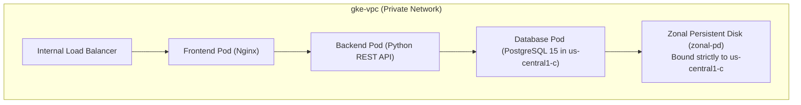
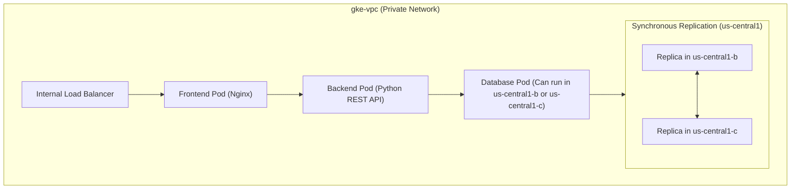

# 3-Tier Private Pets Platform on GKE with Resilient Regional Storage Migration

Welcome to the **Pets Food & Toys Platform** GKE repository. This repository contains the production-ready Kubernetes manifests to deploy a completely secure, fully private 3-tier web application on Google Kubernetes Engine (GKE), alongside a battle-tested operational runbook for migrating stateful workloads from zonal persistent disks to high-availability regional persistent disks with zero data loss.

---

## Architectural Principles

1. **Zero Public Access**: GKE worker nodes have completely private IP addresses.
2. **Secure Ingress**: The frontend web interface is exposed strictly inside the Google Cloud Virtual Private Cloud (VPC) using an Internal Load Balancer (ILB).
3. **Secure Egress**: Outbound connections (e.g., to fetch Python and Alpine dependencies) are securely routed through a regional Cloud NAT gateway.
4. **Zonal State Storage (Initial)**: The stateful database uses dynamically provisioned zonal persistent disks.
5. **Regional High-Availability (Target)**: Stateful storage is upgraded to Google Cloud Regional Persistent Disks (Regional PDs), synchronously replicating data write-by-write across two independent zones.

---

## System Architecture

### 1. Initial State (Zonal Storage)
In our starting setup, the database pod is tied to a single zone. If that zone fails, the database becomes completely unavailable:



### 2. High-Availability Target State (Regional Storage)
After completing the migration, the database is backed by a Regional Persistent Disk that replicates data synchronously across two zones. If one zone fails, GKE hot-migrates the database pod to the healthy zone:



---

## Repository Structure

```
├── kubernetes/
│   ├── 01-storageclass.yaml         # Zonal StorageClass
│   ├── 02-app-code-configmaps.yaml  # Static web & API server codes
│   ├── 03-postgres-db.yaml          # Database Secret, Service & StatefulSet
│   ├── 04-backend.yaml              # Python backend API deployment
│   └── 05-frontend.yaml             # Frontend Nginx deployment & ILB
├── kubernetes/migration/
│   ├── regional-sc.yaml             # Regional StorageClass
│   ├── regional-pv.yaml             # Static Regional PersistentVolume
│   └── regional-pvc.yaml            # Regional PersistentVolumeClaim
└── README.md                        # This documentation and migration guide
```

---

## Part 1: Deployment of the 3-Tier Private Application

### Step 1: Clone and Configure Environment
Authenticate your `kubectl` context to your private GKE cluster:
```bash
gcloud container clusters get-credentials pets-cluster --zone us-central1-c
```

### Step 2: Apply the Kubernetes Manifests
Deploy the platform resources in sequential order:
```bash
kubectl apply -f kubernetes/
```

### Step 3: Verify the Private Deployment
1. **Verify Pod Status**: Ensure all pods are in `Running` status:
   ```bash
   kubectl get pods
   ```
2. **Check Services**: Confirm the frontend is exposed via an Internal Load Balancer IP:
   ```bash
   kubectl get service pets-frontend-service
   ```
3. **Verify Zonal Storage Affinity**: Confirm the database PV is dynamically bound to a zonal disk in `us-central1-c`:
   ```bash
   kubectl describe pv
   ```

---

## Part 2: Migrating a Zonal GKE Workload to Regional Persistent Disks (Regional PD)

This runbook demonstrates how to upgrade the database persistent volume to a Regional PD to achieve high-availability across two zones without any data loss.

### Step 1: Discover & Map Existing Zonal Storage
Discover the GKE nodes' active zones and the GCE disk resource name of your active stateful volume.

1. **Find active worker node zone(s):**
   ```bash
   kubectl get nodes -o custom-columns=NAME:.metadata.name,ZONE:.metadata.labels."topology\.kubernetes\.io\/zone"
   ```
   *Take note of this zone (e.g., `us-central1-c`). Your new Regional PD **must** include this zone in its replication set.*
2. **Map the GCE zonal disk name:**
   ```bash
   kubectl get pv $(kubectl get pvc pets-db-data-pets-db-0 -o jsonpath='{.spec.volumeName}') -o jsonpath='{.spec.csi.volumeHandle}'
   ```
   *This outputs the path:* `projects/<PROJECT_ID>/zones/us-central1-c/disks/<ZONAL_DISK_NAME>`

### Step 2: Gracefully Scale Down the Workload
To ensure transaction consistency and release storage locks, scale the StatefulSet down to `0` replicas:
```bash
kubectl scale statefulset pets-db --replicas=0
```
*Wait until the pod terminates fully:*
```bash
kubectl get pods -l app=pets-db
```

### Step 3: Create a Point-in-Time Snapshot
Take a safe snapshot of the zonal persistent disk:
```bash
gcloud compute snapshots create pets-db-migration-snapshot \
    --source-disk=<ZONAL_DISK_NAME> \
    --source-disk-zone=<ZONAL_DISK_ZONE>
```

### Step 4: Create the New Regional Disk (With Node-Zone Alignment)
Create the new **Regional Persistent Disk** from your snapshot.

> [!IMPORTANT]
> **Production Pro-Tip:** One of your `--replica-zones` must explicitly match the zone of your GKE worker nodes (e.g., `us-central1-c`). Additionally, append a version suffix (e.g., `-v2`) to the disk name to prevent GKE's CSI driver from trying to mount a cached disk UID.

```bash
gcloud compute disks create pets-db-regional-disk-v2 \
    --region=us-central1 \
    --replica-zones=us-central1-b,us-central1-c \
    --source-snapshot=pets-db-migration-snapshot \
    --type=pd-balanced
```

### Step 5: Define the Regional StorageClass in GKE
Deploy the regional high-availability StorageClass directly via standard input:
```bash
cat <<EOF | kubectl apply -f -
apiVersion: storage.k8s.io/v1
kind: StorageClass
metadata:
  name: regional-pd
provisioner: pd.csi.storage.gke.io
volumeBindingMode: WaitForFirstConsumer
parameters:
  type: pd-balanced
  replication-type: regional-pd
EOF
```

### Step 6: Define a Static PV Linking GKE to the Regional Disk
Create a static `PersistentVolume` pointing to your fresh, versioned regional disk (replace `<PROJECT_ID>` with your active GCP project ID):
```bash
cat <<EOF | kubectl apply -f -
apiVersion: v1
kind: PersistentVolume
metadata:
  name: pets-db-regional-pv
spec:
  capacity:
    storage: 10Gi
  accessModes:
    - ReadWriteOnce
  persistentVolumeReclaimPolicy: Retain
  storageClassName: regional-pd
  csi:
    driver: pd.csi.storage.gke.io
    volumeHandle: projects/<PROJECT_ID>/regions/us-central1/disks/pets-db-regional-disk-v2
    fsType: ext4
EOF
```

### Step 7: Clean the Cache and Bind the Regional PVC
Because the StatefulSet is scaled to `0`, delete the old zonal PVC and bind a new regional PVC:

1. **Delete the old zonal PVC:**
   ```bash
   kubectl delete pvc pets-db-data-pets-db-0
   ```
2. **Create the regional PVC:**
   ```bash
   cat <<EOF | kubectl apply -f -
   apiVersion: v1
   kind: PersistentVolumeClaim
   metadata:
     name: pets-db-data-pets-db-0
   spec:
     accessModes:
       - ReadWriteOnce
     storageClassName: regional-pd
     volumeName: pets-db-regional-pv
     resources:
       requests:
         storage: 10Gi
   EOF
   ```

### Step 8: Update and Recreate the StatefulSet
Since `volumeClaimTemplates` are immutable, delete the controller definition and apply your updated manifest configuring `storageClassName: regional-pd`:

```bash
# 1. Delete the scaled-down controller definition
kubectl delete statefulset pets-db

# 2. Apply your updated postgres-db.yaml manifest
kubectl apply -f postgres-db.yaml

# 3. Scale the database back up to 1 replica
kubectl scale statefulset pets-db --replicas=1
```

### Step 9: Verification
Check that the database pod starts up in `Running` status on the regional disk:
```bash
kubectl get pod pets-db-0 -o wide
```
Confirm the Node Affinity of your PV spans both replica zones:
```bash
kubectl describe pv pets-db-regional-pv
```
